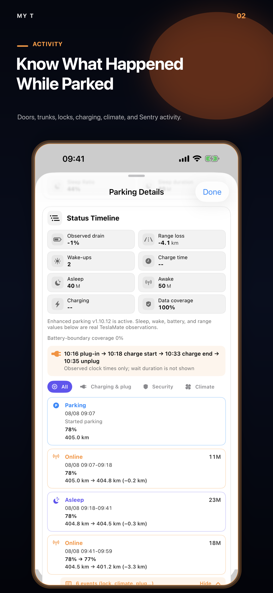
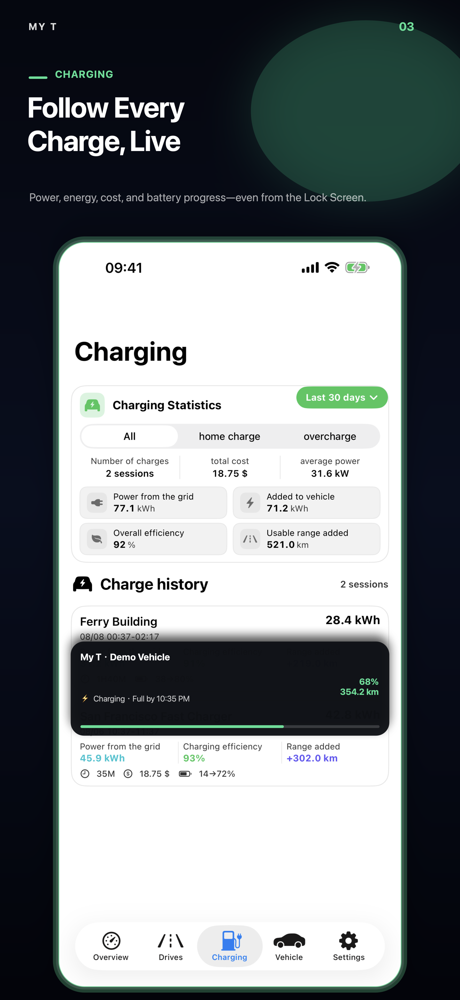
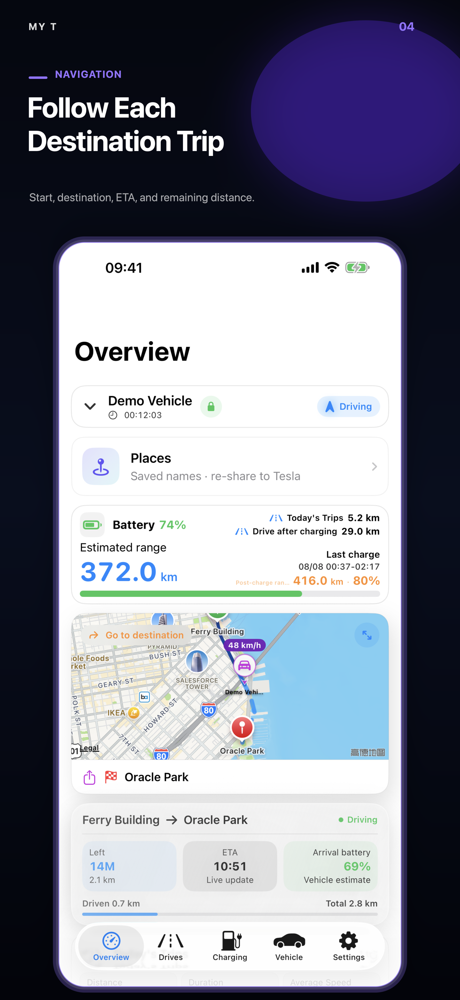
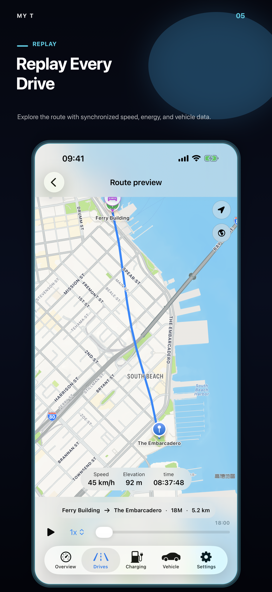
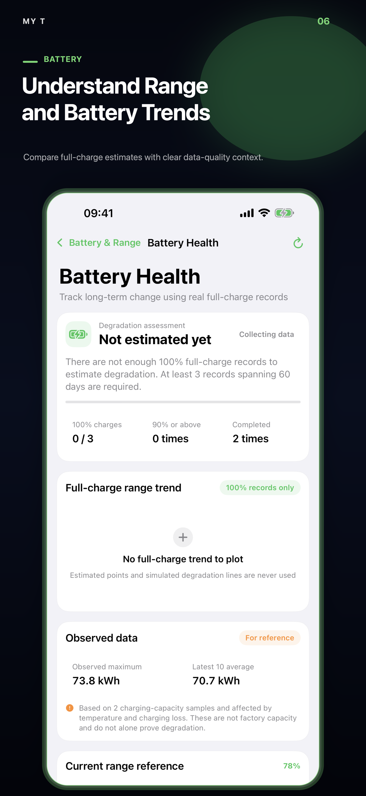

# My T

[English](README.md) · [简体中文](README.zh-Hans.md) · [繁體中文](README.zh-Hant.md)

<p align="center">
  
</p>

**My T is an independent iPhone client for viewing and understanding data from
your own TeslaMate server.**

[Download My T on the App Store](https://apps.apple.com/us/app/my-t/id6780299502) ·
[Setup guide](docs/SETUP.md) ·
[Support](SUPPORT.md) ·
[Privacy](PRIVACY.md)

> **Release status:** **My T 3.32** was submitted to Apple on August 1, 2026 and
> is waiting for review. Until Apple approves it, the currently downloadable
> App Store version may remain older. My T 3.32 supports My T Companion
> **1.10.7** for enhanced parking history, verified trajectories, optional Live
> Activities, and software notifications after secure pairing. See
> [feature availability](docs/FEATURE_AVAILABILITY.md).

This repository contains public product documentation and support material.
**It does not contain the My T application source code.**

## Built around TeslaMate

[TeslaMate](https://github.com/teslamate-org/teslamate) is the foundation of
the self-hosted My T experience. It runs on the user's own server, connects to
the vehicle, records states, drives, charging sessions, positions, and
efficiency data, and keeps that history in the user's PostgreSQL database.

My T turns that TeslaMate history into an iPhone experience with an overview,
searchable trips, charging analysis, daily timelines, maps, and route replay.
It does not replace TeslaMate, operate a separate Tesla account connection, or
move the user's TeslaMate history into a My T cloud.

The three projects have different roles:

| Component | Role |
| --- | --- |
| [TeslaMate](https://github.com/teslamate-org/teslamate) | Primary self-hosted data collector and source of truth |
| [TeslaMateAPI](https://github.com/tobiasehlert/teslamateapi) | JSON bridge used by My T to read normal TeslaMate data |
| [My T Companion](https://github.com/MatchHar/My-T-Companion) | Optional read-only enhancement for parking history, verified drive trajectories, charging/navigation Live Activities, and vehicle software notifications |

New users should deploy and verify TeslaMate first by following its
[official documentation](https://docs.teslamate.org/), then add TeslaMateAPI,
connect My T, and only afterward consider the optional My T Companion.

## What My T does

- Presents vehicle status, battery, rated range, location, and parking duration.
- Organizes drives into searchable history, statistics, daily timelines, and
  animated route replay.
- Shows charging sessions, energy, cost, charging curves, and related trends.
- Supports live vehicle location and genuine active-drive data when the server
  has recorded it.
- Supports multiple self-hosted TeslaMate connections and multiple vehicles.
- Also supports Tessie as a separate optional data source.
- Stores connection credentials in the iOS Keychain.

### Long-term parking, event by event

With the optional My T Companion, enhanced parking retains genuine
observations that a suspended iPhone cannot collect continuously:

- online, offline, sleep, wake, and charging transitions in chronological order;
- battery percentage and rated range at each boundary when TeslaMate reported them;
- cable connected/disconnected and charging started/stopped;
- lock/unlock, doors, windows, front/rear trunks, and charge-port changes;
- Sentry, climate, preconditioning, and battery-heating changes.

The first retained MQTT value after install/restart is a baseline, not an
invented event. Missing battery, range, or event data remains unavailable
instead of being estimated. Parking events are retained long-term by default
with a bounded capacity policy. Standard parking, trip, and charging history
continues to work without Companion.

## How My T works with TeslaMate

```text
Vehicle → TeslaMate → PostgreSQL
                         │
                         ├─ TeslaMateAPI → My T
                         │
                         └─ My T Companion (optional, read-only) → My T
```

Normal vehicle, drive, charge, and statistics data is read through
[TeslaMateAPI](https://github.com/tobiasehlert/teslamateapi). My T may
optionally read the TeslaMate web endpoint to display server-version
information; that endpoint is not required for normal vehicle data.

[My T Companion 1.10.7](https://github.com/MatchHar/My-T-Companion/releases/tag/v1.10.7) is the
current verified server release. It is an
optional server component for genuine long-term parking sleep/wake history,
battery and rated-range observations at state boundaries, retained
plug/charging/security/climate events, reliable current-drive trajectories,
persistent destination-navigation session history (including genuine start
place, destination changes, and real trip timing), and optional
charging/navigation Live Activities or software notifications while the App is
not open (after secure pairing). Basic My T features continue to work without
it. Companion links back to this repository for App availability and setup, so
the two public repositories describe one compatible release path.

## Screenshots

<p>
  
  
  
  
  
  
</p>

Screenshots use demonstration data and do not show a real user's vehicle
location, VIN, server address, or credentials.

See the complete trilingual [My T 3.32 release notes](docs/APP_STORE_3.32.md).

## Requirements

- iPhone with iOS 18 or later.
- Either a working self-hosted TeslaMate deployment with a compatible
  TeslaMateAPI, or a supported Tessie connection.
- A safe path from the iPhone to the API: trusted LAN, VPN/Tailscale, or HTTPS
  with authentication.

My T currently validates against TeslaMateAPI `1.25.0`. Compatibility can
change as upstream projects evolve; see the dated
[compatibility notes](docs/COMPATIBILITY.md) before changing server versions.

## Start here

1. Deploy and verify TeslaMate by following the
   [official TeslaMate documentation](https://docs.teslamate.org/docs/installation/docker/).
2. Add and secure
   [TeslaMateAPI](https://github.com/tobiasehlert/teslamateapi).
3. In My T, open **Settings → Server Connections → TeslaMate Server**.
4. Enter the API root URL and the matching authentication method.
5. Run **Test Connection** and select a vehicle.
6. Optionally deploy My T Companion after the normal connection works.

Never expose TeslaMate, PostgreSQL, MQTT, Grafana, or an unauthenticated API
directly to the Internet. See the [complete setup guide](docs/SETUP.md).

## Privacy

My T has no developer-operated vehicle database. Vehicle history remains on
the server or provider selected by the user. The app reads it directly from
that configured service. See [PRIVACY.md](PRIVACY.md) for the important
distinction between vehicle data and optional iCloud configuration sync.

## Scope and independence

My T is an independent third-party application. It is not affiliated with,
endorsed by, or supported by Tesla, Inc., the TeslaMate project, or the
TeslaMateAPI project. Tesla, TeslaMate, and other names and marks belong to
their respective owners.

## Public repository policy

- App source code, signing material, internal build files, and private
  infrastructure are intentionally excluded.
- Do not post API tokens, passwords, Cloudflare secrets, VINs, coordinates,
  `.env` files, raw logs, or database exports in public issues.
- Security reports must follow [SECURITY.md](SECURITY.md).
- Documentation contributions should follow [CONTRIBUTING.md](CONTRIBUTING.md).

Copyright © 2026 My T. Documentation and product assets are provided under the
terms in [LICENSE.md](LICENSE.md).
