# My T

[English](README.md) · [简体中文](README.zh-Hans.md) · [繁體中文](README.zh-Hant.md)

<p align="center">
  
</p>

**My T is an independent iPhone client for viewing and understanding data from
your own TeslaMate server.**

[Download My T on the App Store](https://apps.apple.com/app/id6780299502) ·
[Setup guide](docs/SETUP.md) ·
[Support](SUPPORT.md) ·
[Privacy](PRIVACY.md)

> **Public release:** [Apple’s App Store listing](https://apps.apple.com/app/id6780299502)
> is the source of truth for the downloadable version. The badge and
> [generated release record](docs/app-store-release.json) update from Apple’s
> public lookup service, so this page does not hard-code a version or predict
> private App Review status.
> Companion compatibility is capability-based; use the
> [latest stable My T Companion release](https://github.com/MatchHar/My-T-Companion/releases/latest)
> for enhanced parking history, verified trajectories, optional Live
> Activities, and software notifications after secure pairing. See
> [feature availability](docs/FEATURE_AVAILABILITY.md).

Verified on **September 10, 2026**: **5.32** is publicly available. **6.01 (620)**
has been submitted and is **Waiting for Review**; its Together features below
are a preview, not a claim that 6.01 is already downloadable. Check Apple's
listing for subsequent availability changes.

[](https://github.com/MatchHar/My-T-Companion/releases/latest)
[](https://apps.apple.com/app/id6780299502)
[](https://apps.apple.com/app/id6798103086)

Need a server backend? **[Download HostBox on the App Store](https://apps.apple.com/app/id6798103086)** to deploy My T Server from iPhone, or read the [HostBox product guide and launch video](https://my-tesla.app/hostbox/en/).

This repository contains public product documentation and support material.
**It does not contain the My T application source code.**

## Built around TeslaMate

[TeslaMate](https://github.com/teslamate-org/teslamate) is the foundation of
the self-hosted My T experience. It runs on the user's own server, connects to
the vehicle, records states, drives, charging sessions, positions, and
efficiency data, and keeps that history in the user's PostgreSQL database.

My T turns that TeslaMate history into an iPhone experience with an overview,
searchable trips, charging analysis, daily timelines, maps, and route replay.
It does not replace TeslaMate, operate a separate Tesla account connection, or
move the user's TeslaMate history into a My T cloud.

The four components have different roles:

| Component | Role |
| --- | --- |
| [TeslaMate](https://github.com/teslamate-org/teslamate) | Primary self-hosted data collector and source of truth |
| [TeslaMateAPI](https://github.com/tobiasehlert/teslamateapi) | JSON bridge used by My T to read normal TeslaMate data |
| [My T Companion](https://github.com/MatchHar/My-T-Companion) | Optional read-only enhancement for parking history, verified drive trajectories, charging/navigation Live Activities, and vehicle software notifications |
| [HostBox](https://apps.apple.com/app/id6798103086) | App Store iPhone deployment app for installing and maintaining the My T Server stack on a user-owned VPS |

New users can use [HostBox](https://my-tesla.app/hostbox/en/) for a guided VPS
deployment, or deploy and verify TeslaMate using its
[official documentation](https://docs.teslamate.org/). Then connect My T and
consider the optional My T Companion if it is not already included.

## What My T does

- Presents battery, range, odometer, lock state, tire pressure, location,
  software-update status, and individual door/window state when available.
- Organizes drives and parking into date-grouped history and a combined
  timeline, with per-drive efficiency and richer telemetry.
- Adds Drive Statistics for mileage trends, temperature, common destinations,
  and weekday comparisons, plus road-following animated route replay.
- Shows charging sessions, energy, cost, live charge telemetry, range-gain
  rate, and battery-health trends based on qualifying recorded data.
- Supports find-car maps, genuine active-drive data, destination progress,
  ETA, and arrival information when the configured service provides them.
- Can optionally notify when a vehicle becomes locked and unoccupied. Every
  iPhone chooses its own visible alert sound; imported audio and filenames stay
  on that device and never go to Companion or the push relay.
- Supports multiple self-hosted TeslaMate connections and multiple vehicles.
- Also supports Tessie as a separate optional data source.
- Stores connection credentials in the iOS Keychain.

### Preview in 6.01: travel together

Together shows two vehicles on one map, with their reported speeds, positions,
and the **driving-road distance** from your selected vehicle to the other.
Switch between both cars, your car, and the other car; keep north up or follow
a vehicle's heading. Navigation and arrival estimates appear when usable data
is available. A route to a moving vehicle's last observed position is an
estimate, not a promised catch-up time.

For two cars on one server, use your existing authorized connection. For
friends on different servers or Tesla accounts, **Friend Together** adds
temporary invitations and separate approval from both owners. Each server
must enable the feature and a dedicated secured sharing endpoint. Notification
pairing alone does not enable it. [Sharing, setup, and limits](docs/TOGETHER.md).

<p>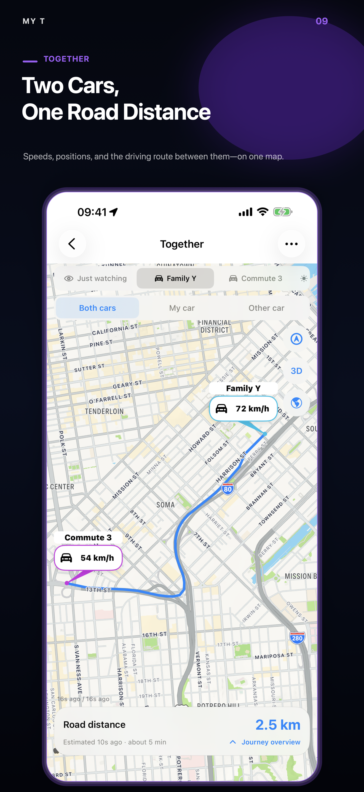</p>

This approved 6.01 preview uses demonstration vehicles and locations.

### Long-term parking, event by event

With the optional My T Companion, enhanced parking retains genuine
observations that a suspended iPhone cannot collect continuously:

- online, offline, sleep, wake, and charging transitions in chronological order;
- battery percentage and rated range at each boundary when TeslaMate reported them;
- cable connected/disconnected and charging started/stopped;
- lock/unlock, doors, windows, front/rear trunks, and charge-port changes;
- Sentry, climate, preconditioning, and battery-heating changes.

The first retained MQTT value after install/restart is a baseline, not an
invented event. Missing battery, range, or event data remains unavailable
instead of being estimated. Parking events are retained long-term by default
with a bounded capacity policy. Standard parking, trip, and charging history
continues to work without Companion.

## How My T works with TeslaMate

```text
Vehicle → TeslaMate → PostgreSQL
                         │
                         ├─ TeslaMateAPI → My T
                         │
                         └─ My T Companion (optional, read-only) → My T
```

Normal vehicle, drive, charge, and statistics data is read through
[TeslaMateAPI](https://github.com/tobiasehlert/teslamateapi). My T may
optionally read the TeslaMate web endpoint to display server-version
information; that endpoint is not required for normal vehicle data.

[The latest stable My T Companion release](https://github.com/MatchHar/My-T-Companion/releases/latest)
is the recommended server release. This permanent link and the badge above
resolve to the current GitHub release automatically. Companion is an
optional server component for genuine long-term parking sleep/wake history,
battery and rated-range observations at state boundaries, retained
plug/charging/security/climate events, reliable current-drive trajectories,
persistent destination-navigation session history (including genuine start
place, destination changes, and real trip timing), and optional
charging/navigation Live Activities or software notifications while the App is
not open (after secure pairing). Basic My T features continue to work without
it. Companion links back to this repository for App availability and setup, so
the two public repositories describe one compatible release path.

## Screenshots

<p>
  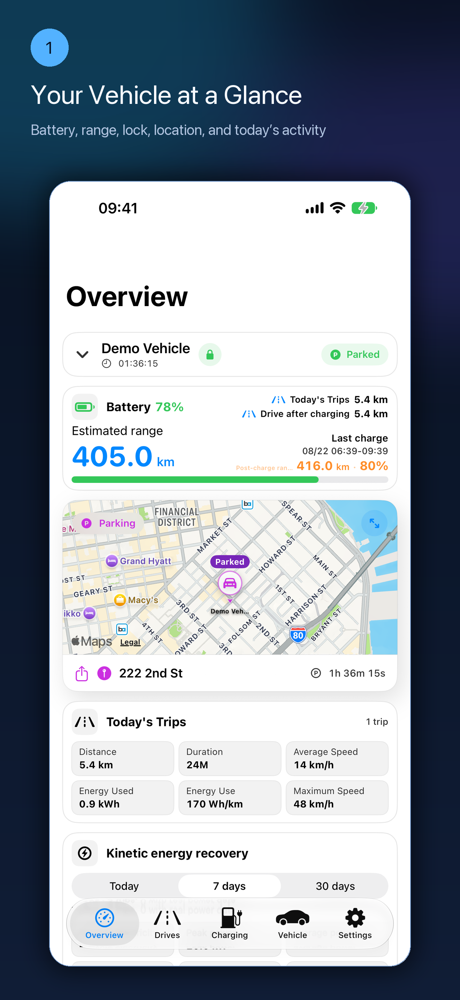
  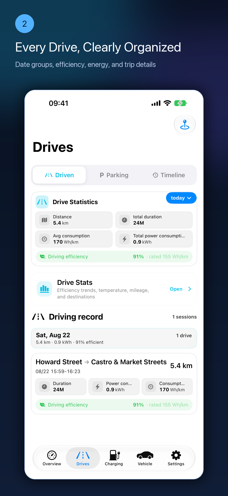
  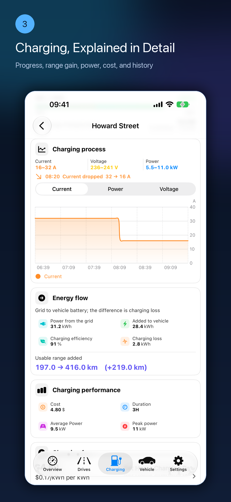
  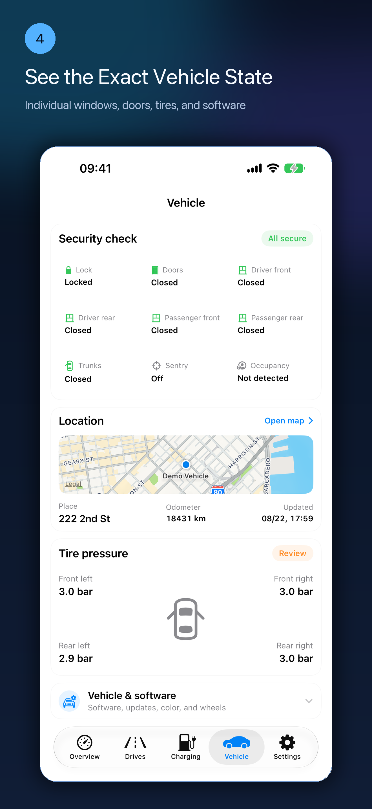
  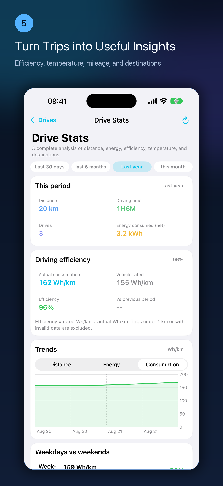
  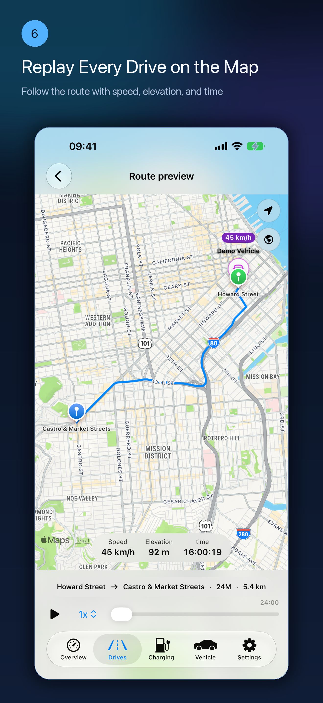
  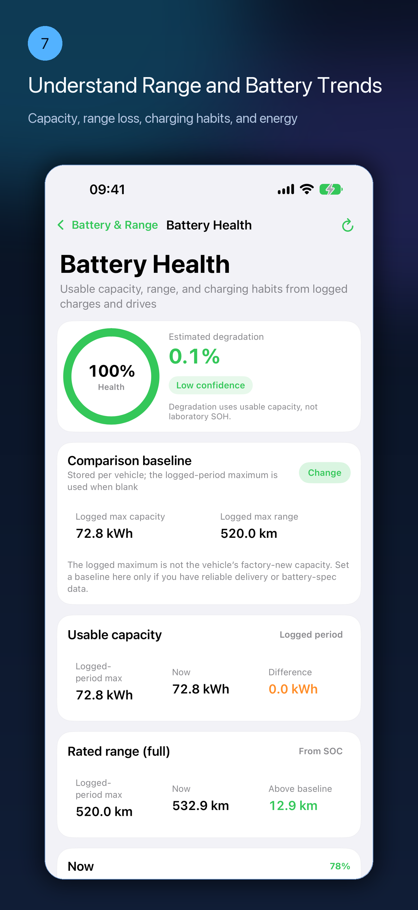
  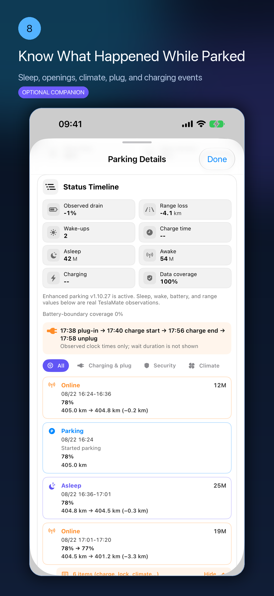
  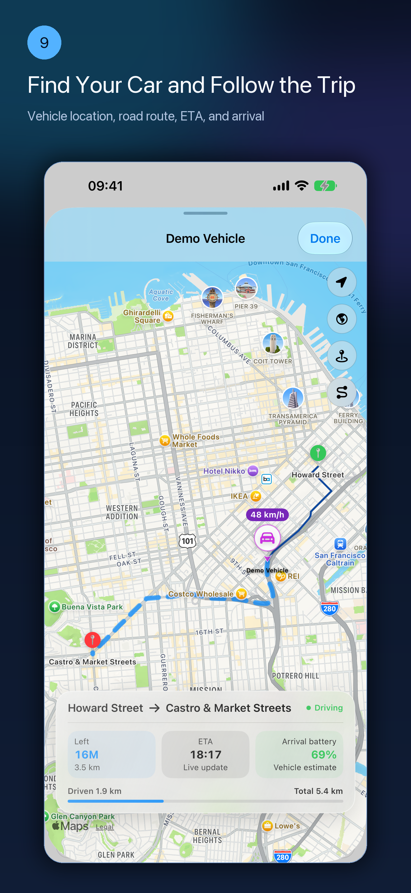
  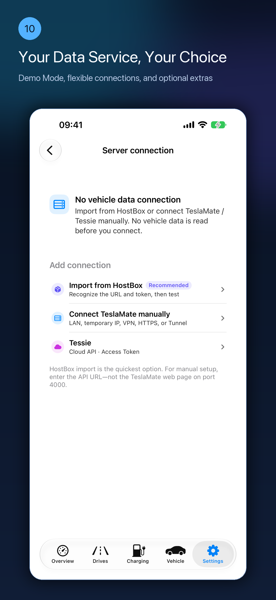
</p>

Screenshots use demonstration data and do not show a real user's vehicle
location, VIN, server address, or credentials.

See the [feature availability notice](docs/FEATURE_AVAILABILITY.md) for the
public-versus-pre-release boundary; older 3.32 notes remain as release history.

## Requirements

- iPhone with iOS 18 or later.
- Either a working self-hosted TeslaMate deployment with a compatible
  TeslaMateAPI, or a supported Tessie connection.
- A safe path from the iPhone to the API: trusted LAN, VPN/Tailscale, or HTTPS
  with authentication.

My T currently validates against TeslaMateAPI `1.25.0`. Compatibility can
change as upstream projects evolve; see the dated
[compatibility notes](docs/COMPATIBILITY.md) before changing server versions.

## Start here

1. Deploy and verify TeslaMate by following the
   [official TeslaMate documentation](https://docs.teslamate.org/docs/installation/docker/).
2. Add and secure
   [TeslaMateAPI](https://github.com/tobiasehlert/teslamateapi).
3. In My T, open **Settings → Server Connections → TeslaMate Server**.
4. Enter the API root URL and the matching authentication method.
5. Run **Test Connection** and select a vehicle.
6. Optionally deploy My T Companion after the normal connection works.

Never expose TeslaMate, PostgreSQL, MQTT, Grafana, or an unauthenticated API
directly to the Internet. See the [complete setup guide](docs/SETUP.md).

## Privacy

My T has no developer-operated vehicle database. Vehicle history remains on
the server or provider selected by the user. The app reads it directly from
that configured service. See [PRIVACY.md](PRIVACY.md) for the important
distinction between vehicle data and optional iCloud configuration sync.

## Scope and independence

My T is an independent third-party application. It is not affiliated with,
endorsed by, or supported by Tesla, Inc., the TeslaMate project, or the
TeslaMateAPI project. Tesla, TeslaMate, and other names and marks belong to
their respective owners.

## Public repository policy

- App source code, signing material, internal build files, and private
  infrastructure are intentionally excluded.
- Do not post API tokens, passwords, Cloudflare secrets, VINs, coordinates,
  `.env` files, raw logs, or database exports in public issues.
- Security reports must follow [SECURITY.md](SECURITY.md).
- Documentation contributions should follow [CONTRIBUTING.md](CONTRIBUTING.md).

Copyright © 2026 My T. Documentation and product assets are provided under the
terms in [LICENSE.md](LICENSE.md).
