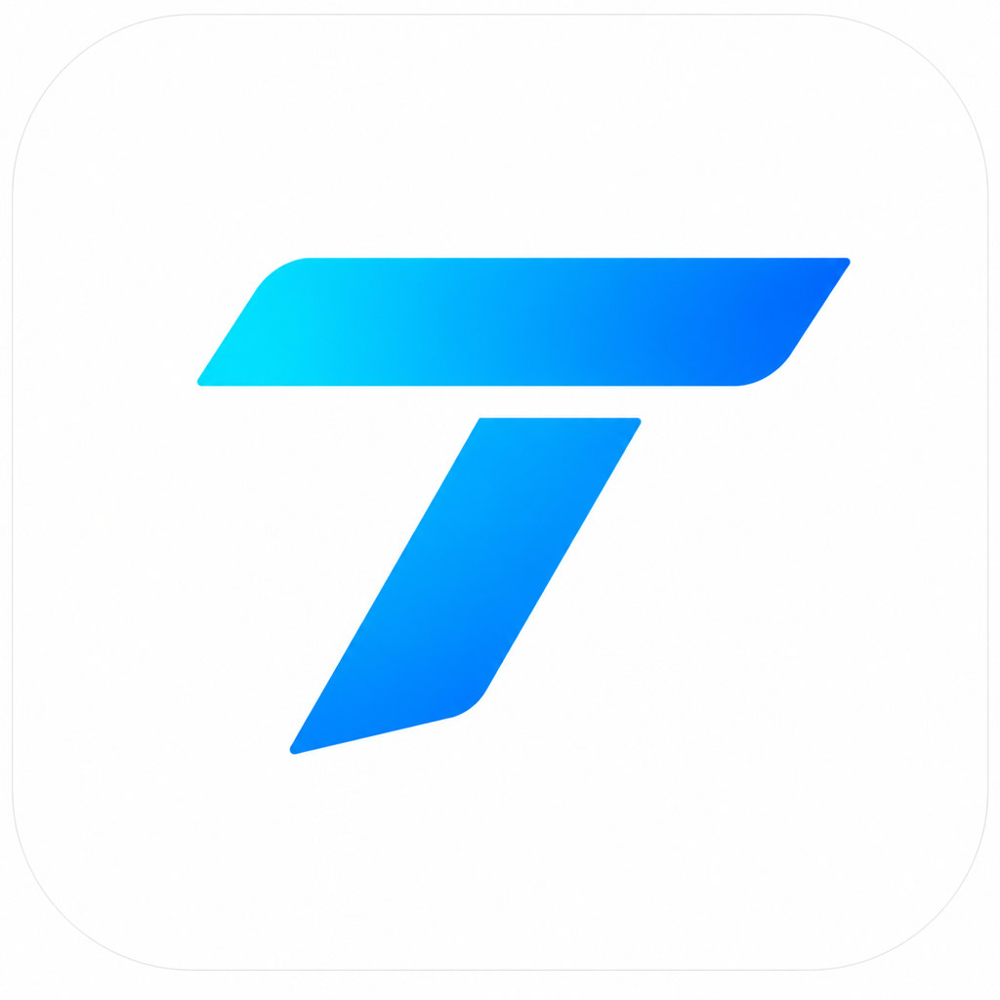
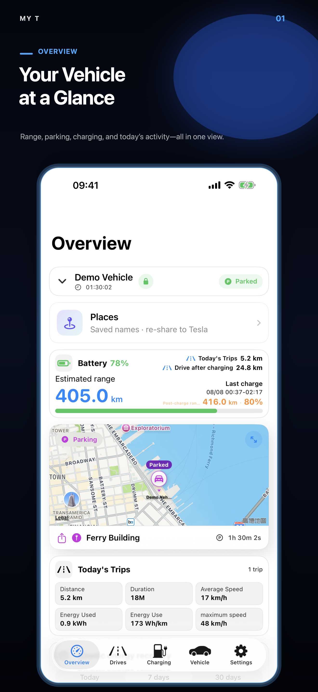

# My T

[English](README.md) · [简体中文](README.zh-Hans.md) · [繁體中文](README.zh-Hant.md)

<p align="center">
  
</p>

**My T is an independent iPhone client for viewing and understanding data from
your own TeslaMate server.**

[Download My T on the App Store](https://apps.apple.com/cn/app/my-t/id6780299502) ·
[Setup guide](docs/SETUP.md) ·
[Support](SUPPORT.md) ·
[Privacy](PRIVACY.md)

This repository contains public product documentation and support material.
**It does not contain the My T application source code.**

## Built around TeslaMate

[TeslaMate](https://github.com/teslamate-org/teslamate) is the foundation of
the self-hosted My T experience. It runs on the user's own server, connects to
the vehicle, records states, drives, charging sessions, positions, and
efficiency data, and keeps that history in the user's PostgreSQL database.

My T turns that TeslaMate history into an iPhone experience with an overview,
searchable trips, charging analysis, daily timelines, maps, and route replay.
It does not replace TeslaMate, operate a separate Tesla account connection, or
move the user's TeslaMate history into a My T cloud.

The three projects have different roles:

| Component | Role |
| --- | --- |
| [TeslaMate](https://github.com/teslamate-org/teslamate) | Primary self-hosted data collector and source of truth |
| [TeslaMateAPI](https://github.com/tobiasehlert/teslamateapi) | JSON bridge used by My T to read normal TeslaMate data |
| [My T Parking Monitor](https://github.com/MatchHar/My-T-Parking-Monitor) | Optional read-only enhancement for detailed parking and live-drive history |

New users should deploy and verify TeslaMate first by following its
[official documentation](https://docs.teslamate.org/), then add TeslaMateAPI,
connect My T, and only afterward consider the optional Parking Monitor.

## What My T does

- Presents vehicle status, battery, rated range, location, and parking duration.
- Organizes drives into searchable history, statistics, daily timelines, and
  animated route replay.
- Shows charging sessions, energy, cost, charging curves, and related trends.
- Supports live vehicle location and genuine active-drive data when the server
  has recorded it.
- Supports multiple self-hosted TeslaMate connections and multiple vehicles.
- Also supports Tessie as a separate optional data source.
- Stores connection credentials in the iOS Keychain.

## How My T works with TeslaMate

```text
Vehicle → TeslaMate → PostgreSQL
                         │
                         ├─ TeslaMateAPI → My T
                         │
                         └─ My T Parking Monitor (optional, read-only) → My T
```

Normal vehicle, drive, charge, and statistics data is read through
[TeslaMateAPI](https://github.com/tobiasehlert/teslamateapi). My T may
optionally read the TeslaMate web endpoint to display server-version
information; that endpoint is not required for normal vehicle data.

[My T Parking Monitor](https://github.com/MatchHar/My-T-Parking-Monitor) is an
optional server component for genuine long-term parking sleep/wake history,
battery/range observations, and reliable current-drive trajectories. Basic My T
features continue to work without it.

## Screenshots

<p>
  
  
  
  
</p>

Screenshots use demonstration data and do not show a real user's vehicle
location, VIN, server address, or credentials.

## Requirements

- iPhone with iOS 18 or later.
- A working self-hosted TeslaMate deployment.
- A compatible TeslaMateAPI deployment for the TeslaMate data source.
- A safe path from the iPhone to the API: trusted LAN, VPN/Tailscale, or HTTPS
  with authentication.

My T currently validates against TeslaMateAPI `1.25.0`. Compatibility can
change as upstream projects evolve; see the dated
[compatibility notes](docs/COMPATIBILITY.md) before changing server versions.

## Start here

1. Deploy and verify TeslaMate by following the
   [official TeslaMate documentation](https://docs.teslamate.org/docs/installation/docker/).
2. Add and secure
   [TeslaMateAPI](https://github.com/tobiasehlert/teslamateapi).
3. In My T, open **Settings → Server Connections → TeslaMate Server**.
4. Enter the API root URL and the matching authentication method.
5. Run **Test Connection** and select a vehicle.
6. Optionally deploy My T Parking Monitor after the normal connection works.

Never expose TeslaMate, PostgreSQL, MQTT, Grafana, or an unauthenticated API
directly to the Internet. See the [complete setup guide](docs/SETUP.md).

## Privacy

My T has no developer-operated vehicle database. Vehicle history remains on
the server or provider selected by the user. The app reads it directly from
that configured service. See [PRIVACY.md](PRIVACY.md) for the important
distinction between vehicle data and optional iCloud configuration sync.

## Scope and independence

My T is an independent third-party application. It is not affiliated with,
endorsed by, or supported by Tesla, Inc., the TeslaMate project, or the
TeslaMateAPI project. Tesla, TeslaMate, and other names and marks belong to
their respective owners.

## Public repository policy

- App source code, signing material, internal build files, and private
  infrastructure are intentionally excluded.
- Do not post API tokens, passwords, Cloudflare secrets, VINs, coordinates,
  `.env` files, raw logs, or database exports in public issues.
- Security reports must follow [SECURITY.md](SECURITY.md).

Copyright © 2026 My T. Documentation and product assets are provided under the
terms in [LICENSE.md](LICENSE.md).
