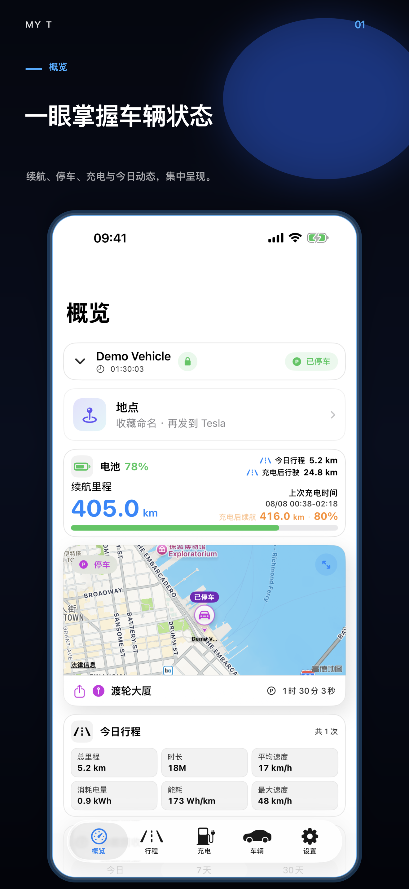
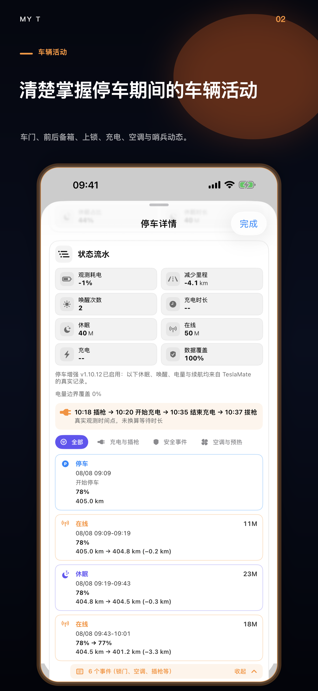
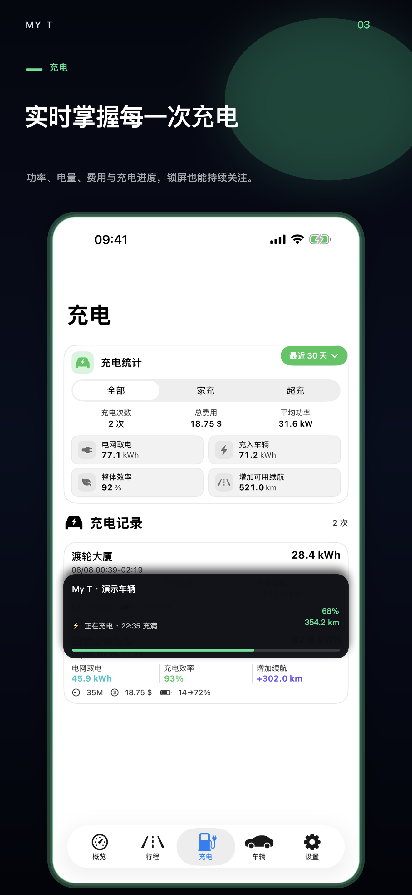
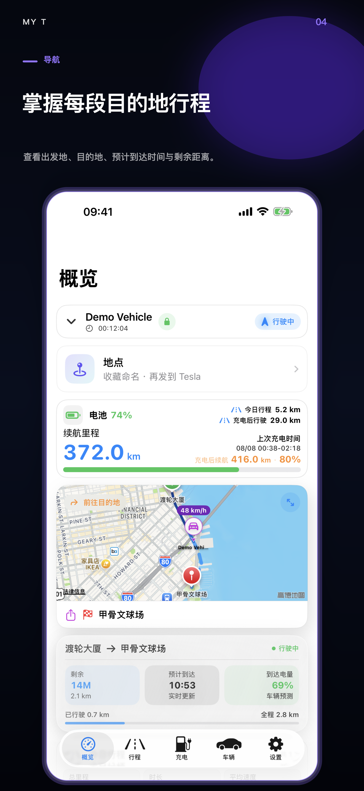
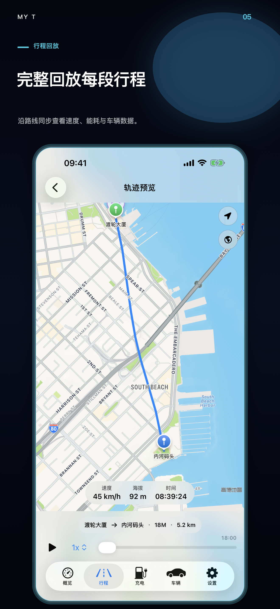
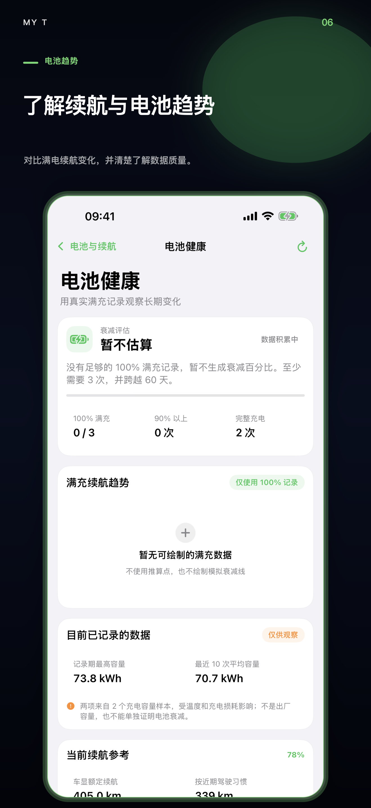

# My T

[English](README.md) · [简体中文](README.zh-Hans.md) · [繁體中文](README.zh-Hant.md)

<p align="center">
  
</p>

**My T 是用于查看和理解用户自建 TeslaMate 数据的独立 iPhone 客户端。**

[前往 App Store 下载 My T](https://apps.apple.com/us/app/my-t/id6780299502) ·
[部署指南](docs/SETUP.zh-Hans.md) ·
[技术支持](SUPPORT.md) ·
[隐私说明](PRIVACY.md)

> **发布状态：** **My T 3.32** 已于 2026 年 8 月 1 日提交 Apple，目前等待审核。
> Apple 审核通过前，App Store 可下载版本仍可能是旧版。My T 3.32 支持
> My T Companion **1.10.7**，用于增强停车历史、真实轨迹，以及安全配对后的
> 可选实时活动与软件通知。详情请看
> [功能可用性说明](docs/FEATURE_AVAILABILITY.md)。

本仓库只包含公开的产品介绍、部署文档和支持资料，**不包含 My T App
源代码**。

## My T 以 TeslaMate 为核心

[TeslaMate](https://github.com/teslamate-org/teslamate) 是 My T 自建服务
体验的基础。它运行在用户自己的服务器上，负责连接车辆、记录车辆状态、行程、
充电、位置和能耗数据，并将历史保存在用户自己的 PostgreSQL 数据库。

My T 把 TeslaMate 保存的这些数据整理成适合 iPhone 使用的概览、可搜索行程、
充电分析、每日时间线、地图和路线回放。My T 不会替代 TeslaMate，不会另行连接
用户的 Tesla 账号，也不会把 TeslaMate 车辆历史转移到 My T 运营的云端。

三个项目分工不同：

| 组件 | 作用 |
| --- | --- |
| [TeslaMate](https://github.com/teslamate-org/teslamate) | 使用自建连接时的主要数据采集器和数据依据 |
| [TeslaMateAPI](https://github.com/tobiasehlert/teslamateapi) | 将普通 TeslaMate 数据以 JSON 提供给 My T 的连接层 |
| [My T 增强服务](https://github.com/MatchHar/My-T-Companion) | 选装的只读扩展：长期停车、真实行驶轨迹、充电/导航实时活动及车辆软件通知 |

新用户应先按照 [TeslaMate 官方文档](https://docs.teslamate.org/) 部署并验证
TeslaMate，再安装 TeslaMateAPI、连接 My T，最后按需要选装 My T 增强服务。

## My T 可以做什么

- 查看车辆状态、电量、额定续航、位置和停车时长。
- 将行程整理为可搜索历史、统计、每日时间线和动态路线回放。
- 查看充电记录、电量、费用、充电曲线与趋势。
- 在服务器保存了真实数据时显示车辆实时位置及正在行驶信息。
- 支持多个自建 TeslaMate 连接和多辆车。
- 也可将 Tessie 作为另一种独立数据源。
- 连接凭证保存在 iOS Keychain。

### 长期停车：逐个动作查看

安装可选的 My T 增强服务后，停车监控可以持续保存 iPhone 挂起期间无法连续
采集的真实观测：

- 按时间顺序显示在线、离线、休眠、唤醒与充电状态；
- 在 TeslaMate 确实报告时，显示每个边界的电量百分比和额定续航；
- 插枪、拔枪、开始充电与停止充电；
- 锁车、解锁、车门、车窗、前后备厢及充电口变化；
- 哨兵、空调、预热与电池加热变化。

安装或重启后的第一个 MQTT 保留值只建立基线，不会生成假事件。缺少电量、
续航或动作数据时保持缺失，不估算。停车事件默认长期保存，并有容量上限防止
无限增长。未安装增强服务时，普通停车、行程与充电历史仍可正常使用。

## My T 如何配合 TeslaMate

```text
车辆 → TeslaMate → PostgreSQL
                       │
                       ├─ TeslaMateAPI → My T
                       │
                       └─ My T 增强服务（选装、只读）→ My T
```

普通车辆、行程、充电和统计数据通过
[TeslaMateAPI](https://github.com/tobiasehlert/teslamateapi) 读取。My T
可能选择性访问 TeslaMate 网页接口以显示服务器版本；普通车辆数据不依赖网页
接口。

[My T 增强服务 1.10.7](https://github.com/MatchHar/My-T-Companion/releases/tag/v1.10.7)
是当前已验证的服务器正式版。它是选装服务器组件，用于真实的长期停车休眠/唤醒历史、状态边界的电量与额定
续航观测、已保留的插枪/充电/安防/开闭/空调等 MQTT 事件、可靠的正在行驶
轨迹、带真实起点／目的地变更／行程时间的导航会话历史，以及在完成安全配对
后、App 未打开时的可选充电/导航锁屏实时活动与软件通知。未安装时，My T
基础功能继续正常使用。Companion 也会链接回本仓库的 App 可用性与部署说明，
两个公开仓库共同说明同一条兼容使用路径。

## 界面预览

<p>
  
  
  
  
  
  
</p>

截图使用演示数据，不包含真实用户的位置、VIN、服务器地址或凭证。

查看完整三语版 [My T 3.32 更新说明](docs/APP_STORE_3.32.md)。

## 使用条件

- iOS 18 或更高版本的 iPhone。
- 已正常运行的自建 TeslaMate 与兼容的 TeslaMateAPI，或受支持的 Tessie 连接。
- iPhone 能通过可信局域网、VPN/Tailscale，或带认证的 HTTPS 安全访问 API。

My T 当前已验证 TeslaMateAPI `1.25.0`。上游项目升级后兼容性可能变化，修改
服务器版本前请查看带日期的[兼容性说明](docs/COMPATIBILITY.md)。

## 开始使用

1. 按照 [TeslaMate 官方文档](https://docs.teslamate.org/docs/installation/docker/)
   部署并确认 TeslaMate 正常采集数据。
2. 安装并保护
   [TeslaMateAPI](https://github.com/tobiasehlert/teslamateapi)。
3. 在 My T 中打开“设置 → 管理连接 → TeslaMate 服务器”。
4. 填写 API 根地址和相应认证方式。
5. 执行“测试连接”并选择车辆。
6. 普通连接成功后，再按需要选装 My T 增强服务。

切勿把 TeslaMate、PostgreSQL、MQTT、Grafana 或无认证 API 直接暴露到公网。
请阅读[完整部署指南](docs/SETUP.zh-Hans.md)。

## 隐私

My T 不运营车辆历史数据库。车辆数据仍保存在用户选择的自建服务器或服务商，
App 直接从已配置的数据源读取。只有用户主动启用的软件通知或实时活动会使用
推送中继，并且只发送完成通知投递所需的最少数据；详见
[PRIVACY.md](PRIVACY.md)。

## 独立项目声明

My T 是独立第三方应用，与 Tesla, Inc.、TeslaMate 项目及 TeslaMateAPI 项目
不存在隶属、认可或官方支持关系。相关名称及商标归各自权利人所有。

## 公开仓库安全规则

- App 源代码、签名材料、内部构建文件和私人基础设施不会公开。
- 请勿在 Issue 中提交 API Token、密码、Cloudflare Secret、VIN、坐标、
  `.env`、原始日志或数据库导出。
- 安全问题请按照 [SECURITY.md](SECURITY.md) 私下报告。
- 文档贡献请遵循 [CONTRIBUTING.md](CONTRIBUTING.md)。

Copyright © 2026 My T。文档与产品素材使用条款见 [LICENSE.md](LICENSE.md)。
