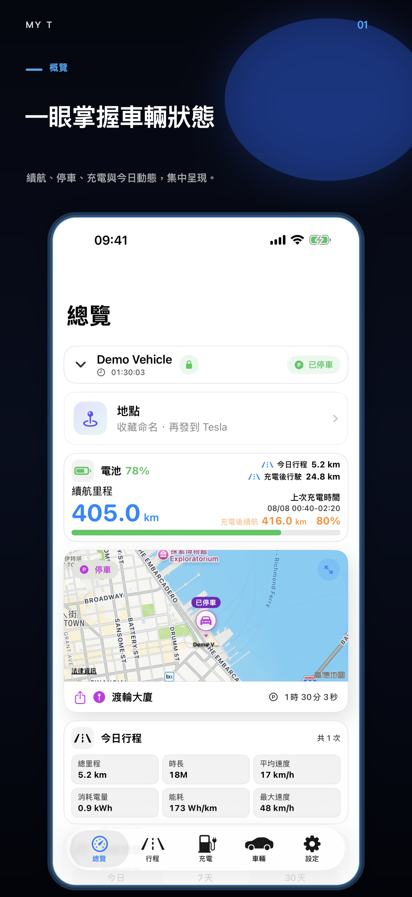

# My T

[English](README.md) · [简体中文](README.zh-Hans.md) · [繁體中文](README.zh-Hant.md)

<p align="center">
  
</p>

**My T 是用於查看及理解使用者自建 TeslaMate 資料的獨立 iPhone 用戶端。**

[前往 App Store 下載 My T](https://apps.apple.com/us/app/my-t/id6780299502) ·
[部署指南](docs/SETUP.zh-Hant.md) ·
[技術支援](SUPPORT.md) ·
[隱私說明](PRIVACY.md)

> **功能可用性：**App Store 公開版為 **My T 3.10**（無 Companion 相關介面）。
> **TestFlight / 預發布 My T 3.20+** 已支援 My T Companion **1.9.2**（長期停車
> 流水、觀測事件、軌跡，以及配對後的可選即時動態）。詳情請參閱
> [功能可用性說明](docs/FEATURE_AVAILABILITY.md)。

本倉庫只包含公開的產品介紹、部署文件及支援資料，**不包含 My T App
原始碼**。

## My T 以 TeslaMate 為核心

[TeslaMate](https://github.com/teslamate-org/teslamate) 是 My T 自建服務
體驗的基礎。它運作於使用者自己的伺服器，負責連線車輛、記錄車輛狀態、行程、
充電、位置及能耗資料，並將歷史儲存於使用者自己的 PostgreSQL 資料庫。

My T 將 TeslaMate 儲存的資料整理成適合 iPhone 使用的概覽、可搜尋行程、
充電分析、每日時間線、地圖及路線回放。My T 不會取代 TeslaMate，不會另外連線
使用者的 Tesla 帳號，也不會將 TeslaMate 車輛歷史轉移至 My T 營運的雲端。

三個專案分工不同：

| 元件 | 作用 |
| --- | --- |
| [TeslaMate](https://github.com/teslamate-org/teslamate) | 主要的自建資料採集器及唯一資料來源 |
| [TeslaMateAPI](https://github.com/tobiasehlert/teslamateapi) | 將一般 TeslaMate 資料以 JSON 提供給 My T 的連線層 |
| [My T 擴充服務](https://github.com/MatchHar/My-T-Companion) | 選裝的唯讀擴充：長期停車、真實行駛軌跡、充電／導航即時動態及車輛軟體通知 |

新使用者應先依照 [TeslaMate 官方文件](https://docs.teslamate.org/) 部署並驗證
TeslaMate，再安裝 TeslaMateAPI、連線 My T，最後按需要選裝 My T 擴充服務。

## My T 可以做什麼

- 查看車輛狀態、電量、額定續航、位置及停車時長。
- 將行程整理為可搜尋歷史、統計、每日時間線及動態路線回放。
- 查看充電記錄、電量、費用、充電曲線及趨勢。
- 在伺服器儲存了真實資料時顯示車輛即時位置及正在行駛資訊。
- 支援多個自建 TeslaMate 連線及多輛車。
- 亦可將 Tessie 作為另一種獨立資料來源。
- 連線憑證儲存於 iOS Keychain。

## My T 如何配合 TeslaMate

```text
車輛 → TeslaMate → PostgreSQL
                       │
                       ├─ TeslaMateAPI → My T
                       │
                       └─ My T 擴充服務（選裝、唯讀）→ My T
```

一般車輛、行程、充電及統計資料透過
[TeslaMateAPI](https://github.com/tobiasehlert/teslamateapi) 讀取。My T
可能選擇性存取 TeslaMate 網頁介面以顯示伺服器版本；一般車輛資料不依賴網頁
介面。

[My T 擴充服務](https://github.com/MatchHar/My-T-Companion)
是選裝伺服器元件，用於真實的長期停車休眠／喚醒歷史、狀態邊界的電量與額定
續航觀測、已保留的插槍／充電／保全／開關／空調等 MQTT 事件、可靠的目前行駛
軌跡，以及在完成安全配對後、App 未開啟時的可選充電／導航鎖定畫面即時動態與
軟體通知。未安裝時，My T 基礎功能仍可正常使用。

## 介面預覽

<p>
  
  
  
  
</p>

截圖使用示範資料，不包含真實使用者的位置、VIN、伺服器位址或憑證。

## 使用條件

- iOS 18 或更高版本的 iPhone。
- 已正常運作的自建 TeslaMate。
- 使用 TeslaMate 資料來源時需要相容的 TeslaMateAPI。
- iPhone 能透過可信區域網路、VPN/Tailscale，或帶驗證的 HTTPS 安全存取 API。

My T 目前已驗證 TeslaMateAPI `1.25.0`。上游專案升級後相容性可能改變，修改
伺服器版本前請查看附日期的[相容性說明](docs/COMPATIBILITY.md)。

## 開始使用

1. 按照 [TeslaMate 官方文件](https://docs.teslamate.org/docs/installation/docker/)
   部署並確認 TeslaMate 正常採集資料。
2. 安裝並保護
   [TeslaMateAPI](https://github.com/tobiasehlert/teslamateapi)。
3. 在 My T 開啟「設定 → 管理連線 → TeslaMate 伺服器」。
4. 填寫 API 根位址及相應驗證方式。
5. 執行「測試連線」並選擇車輛。
6. 一般連線成功後，再按需要選裝 My T 擴充服務。

切勿將 TeslaMate、PostgreSQL、MQTT、Grafana 或無驗證 API 直接暴露至公網。
請閱讀[完整部署指南](docs/SETUP.zh-Hant.md)。

## 獨立專案聲明

My T 是獨立第三方應用程式，與 Tesla, Inc.、TeslaMate 專案及 TeslaMateAPI
專案不存在隸屬、認可或官方支援關係。相關名稱及商標歸各自權利人所有。

## 公開倉庫安全規則

- App 原始碼、簽署材料、內部建置檔案及私人基礎設施不會公開。
- 請勿在 Issue 中提交 API Token、密碼、Cloudflare Secret、VIN、座標、
  `.env`、原始日誌或資料庫匯出。
- 安全問題請依照 [SECURITY.md](SECURITY.md) 私下回報。
- 文件貢獻請遵循 [CONTRIBUTING.md](CONTRIBUTING.md)。

Copyright © 2026 My T。文件與產品素材使用條款見 [LICENSE.md](LICENSE.md)。
